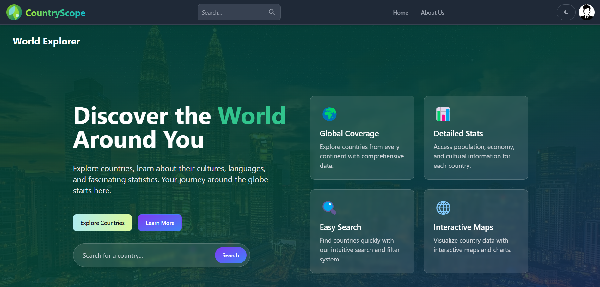

[](https://classroom.github.com/a/mNaxAqQD)

<h1>
  <a href="https://country-scope-kappa.vercel.app/"><p>🌍 CountryScope</p></a>
</h1>

<p><a href="#"></a></p>

CountryScope is a responsive React web app that allows users to search, filter, and explore information about countries from around the world. It’s designed with an intuitive UI using **React.js**, **Flowbite React** and **Tailwind CSS**.

The entire system is thoroughly tested using unit, integration testing to ensure accuracy.

### 🌐 Live Demo
🔗 **[CountryScope](https://country-scope-kappa.vercel.app/)**

## Table of Contents
- [Setup Instructions](#setup-installation)
- [Features](#features)
- [Tech Stack](#tech-stack)
- [API Reference](#api-reference)
- [Running Tests](#running-tests)
- [Deployment](#deployment)

## Setup Instructions

### Prerequisites

Ensure you have the following installed:

- <a href="https://nodejs.org/en">Node.js</a>

### Installation Steps

1. Clone the repository:
```bash
git clone https://github.com/SE1020-IT2070-OOP-DSA-25/af-2-ramindu-Nimex.git
```

2. Install dependencies:
```bash
npm install
```

3. Create a `.env` file in the root directory and configure the following variable:
```bash
VITE_FIREBASE_API_KEY = Your FireBase API Key
```

4. Run the development server:
```bash
npm run dev
```
The app will be running at `http://localhost:5173/`

## Features

- 🔎 **Search countries** by name
- 🌐 **Filter countries** by region
- 📍 View detailed information (flag, population, capital, region, languages, etc.)
- 🌙 Supports dark mode via redux and Flowbite
- 📱 Fully responsive across mobile, tablet, and desktop

## Tech Stack

- **React.js** – Frontend JavaScript library
- **Tailwind CSS** – Utility-first CSS framework
- **Flowbite** – UI components built on Tailwind CSS
- **REST Countries API** – Country data provider
- **Vercel** – Hosting and deployment platform

## API Reference

This project uses the [REST Countries API](https://restcountries.com/) to fetch real-time country data.

### 🔗 Base URL
```bash
https://restcountries.com/v3.1
```

### Endpoints Used

| Endpoint           | Description                |
|--------------------|----------------------------|
| `/all`             | Fetch all countries        |
| `/name/{name}`     | Search countries by name   |
| `/region/{region}` | Filter countries by region |
| `/alpha/{code}`    | Get country by alpha code  |

## Running Tests

### Unit & Integration Tests

The project includes tests written using `jest` and `react-scripts`.

Run tests with:
```bash
npm test
```

## Deployment

This project is deployed using [Vercel](https://vercel.com/).



## Copyright
© 2025 Nimes RHR(IT22577160). All rights reserved.